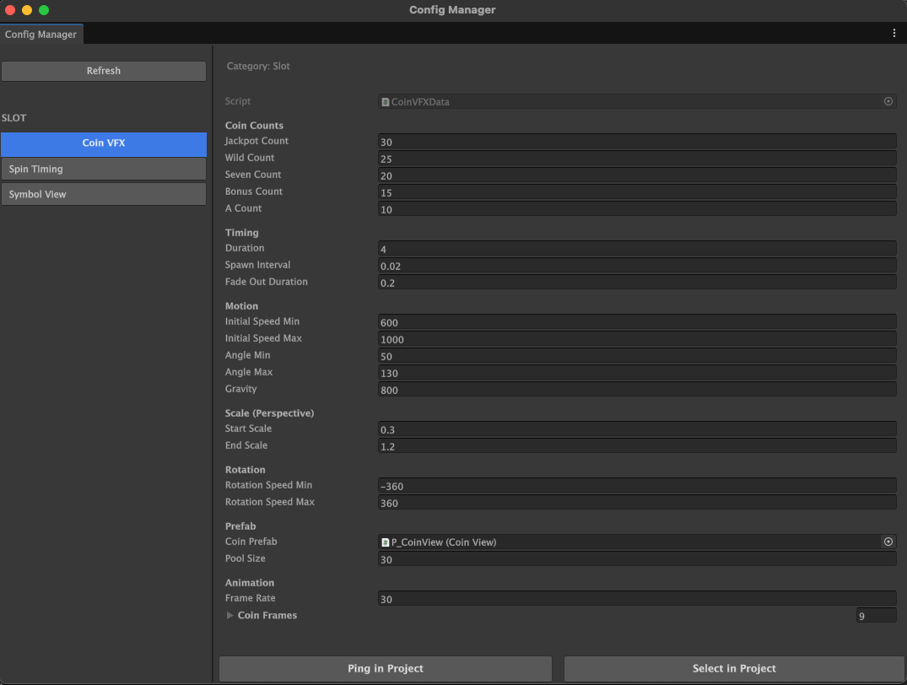

# Config Management

A lightweight editor tool that provides centralized management of all ScriptableObject configs through auto-discovery and a split-panel EditorWindow.

---

## Related Files

```
Systems/ConfigManagement/
├── Runtime/
│   └── IVisibleConfig              Marker interface for discoverable configs
├── Editor/
│   └── ConfigManagerWindow         Split-panel EditorWindow (list + inspector)
```

---

## Core Concepts

### IVisibleConfig

Marker interface that all config ScriptableObjects must implement to appear in the Config Manager.

```csharp
public interface IVisibleConfig
{
    string ConfigName { get; }   // Display name in the window
    string Category { get; }     // Category for grouping (e.g., "Slot")
}
```

Implementations use **explicit interface implementation** to keep the config's public API clean:

```csharp
string IVisibleConfig.ConfigName => "Spin Timing";
string IVisibleConfig.Category => "Slot";
```

### Auto-Discovery

The system requires **zero registration**. Any ScriptableObject implementing `IVisibleConfig` is discovered automatically via `AssetDatabase.FindAssets("t:ScriptableObject")`, filtered, and sorted by Category then ConfigName.

---

## Current Implementations

| Config | Category | Description |
|--------|----------|-------------|
| `CoinVFXData` | Slot | Coin particle counts, motion, scale, rotation, animation |
| `SpinTimingData` | Slot | Spin speed, ramp up, snap, durations per StopMode |
| `SymbolViewData` | Slot | Symbol sprite mappings (normal + blur) and fade settings |

---

## Editor Tool

### ConfigManagerWindow

**Menu:** `Tools > Slot Machine > Configuration Manager`



**Layout:**

| Area | Width | Content |
|------|-------|---------|
| Left panel | 250px | "Configurations" header, Refresh button, categorized config list |
| Separator | 2px | Dark vertical line |
| Right panel | Remaining | Config name + category header, cached inspector, Ping/Select buttons |

**Left panel:**

- Configs are grouped by category with uppercase headers (e.g., `SLOT`).
- Each config is a 28px button. Selected config is highlighted with Unity blue.
- **Refresh** button re-scans the project for `IVisibleConfig` assets.

**Right panel:**

- **Header:** ConfigName (18px, bold) and Category subtitle (11px, grey).
- **Inspector:** Cached `Editor` instance for the selected config. Label width is set to 180px. Supports custom inspectors — if a `[CustomEditor]` exists for the config type, it is used automatically.
- **Footer:** "Ping in Project" and "Select in Project" buttons for quick asset navigation.

**Performance:** The `Editor` instance is cached per selection and destroyed on deselect to avoid per-frame allocation.

---

## Assembly Structure

| Assembly | Platform | Dependencies |
|----------|----------|--------------|
| `SlotMachine.ConfigManagement` | All | None |
| `SlotMachine.ConfigManagement.Editor` | Editor only | `SlotMachine.ConfigManagement`, `SlotMachine.Core` |

The runtime assembly has **no dependencies** and is auto-referenced, so any assembly can implement `IVisibleConfig`.

---

## Typical Workflow

1. Create a ScriptableObject class implementing `IVisibleConfig`.
2. Create an asset instance via the `CreateAssetMenu`.
3. Open `Tools > Slot Machine > Configuration Manager`.
4. The config appears automatically, grouped by category.
5. Select a config to view and edit its fields in the right panel.
6. Use **Ping in Project** or **Select in Project** to locate the asset.
