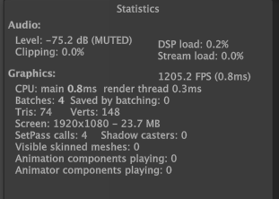
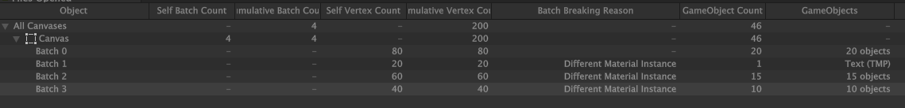
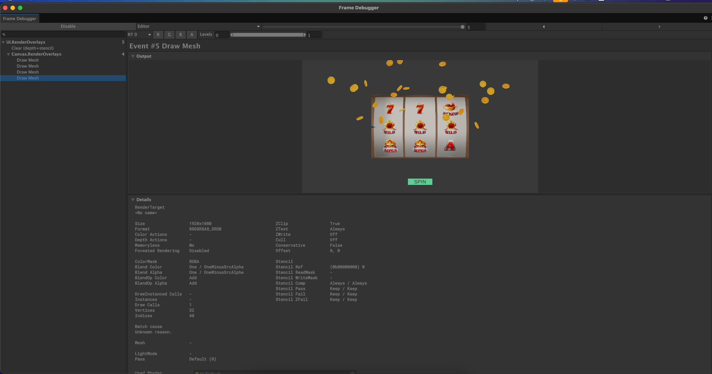
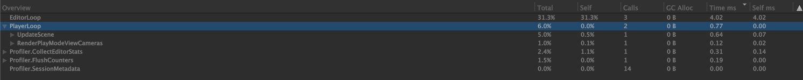

# Batching Optimizasyonları

Bu doküman, slot makinesi sahnesinde batch sayısını düşürmek için uygulanan optimizasyonları ve sonrasında alınan ölçümleri özetler.

## Uygulanan Optimizasyonlar

### 1. Tek Atlas'a Konsolidasyon

Proje başlangıcında sprite'lar üç ayrı atlas içinde gruplanmıştı: reel sembolleri (`SA_Reel`), slot çerçevesi / arka plan (`SA_Slot`) ve coin particle sprite'ları. Her atlas Canvas tarafında ayrı bir material instance oluşturduğu için her geçiş batch kırılmasına yol açıyordu.

Tüm sprite'lar tek bir **`SA_Main`** atlasına taşındı. Böylece semboller, coin'ler ve arka plan aynı texture'ı paylaşır hale geldi ve spin sırasındaki coin burst çizimleri sembollerle aynı batch'te toplanabildi.

### 2. Spin Butonu Sprite'ı

Spin butonu başlangıçta Unity'nin default built-in `UISprite` resource'unu kullanıyordu. Bu sprite ana atlasın dışında kaldığı için ek bir batch break üretiyordu.

Buton arka planı, `SA_Main` içinde zaten bulunan **32×32 beyaz sprite'a** çevrildi (`Image.Type = Simple`, renk tint ile uygulanıyor). Böylece buton arka planı diğer UI elementleriyle aynı batch'e dahil oldu.

### 3. TMP "Spin" Text'i — Bilinçli Tercih

"Spin" yazısı TMP font atlasını kullandığı için ayrı bir batch üretiyor. Bu text, butona statik bir sprite olarak gömülerek batch sayısı 1 daha azaltılabilirdi. Ancak bu yaklaşım:

- Runtime'da metin değişimini engeller (örn. "Spinning...", "Auto Spin")
- Lokalizasyonu bozar; her dil için ayrı sprite üretmek gerekir

Dinamik metin ve lokalizasyon desteği korunarak bu 1 batch maliyeti kabul edildi.

### 4. Kullanılmayan Render Pipeline Özelliklerinin Temizlenmesi

2D tabanlı bir slot sahnesinde ihtiyaç duyulmayan render pipeline özellikleri asset/sahne seviyesinde devre dışı bırakıldı:

- **SSAO renderer feature** `URP_Renderer` asset'inden kaldırıldı. Screen Space Ambient Occlusion 3D geometri ile çalışır; 2D bir sahnede sadece pipeline pass'i ve shader variant maliyeti üretiyordu.
- **Camera Clear Flags** `Skybox` → `Solid Color` yapıldı ve `SkyboxMaterial` (Lighting → Environment) referansı `None` olarak bırakıldı. Böylece default skybox material'i build'e dahil edilmiyor.
- **Depth Texture** ve **Opaque Texture** `URP_RPAsset` üzerinden kapatıldı. İkisi de shader'ların sahne derinliğini / rengini sample etmesi için kullanılır (soft particles, refraction, post-process derinlik efektleri). Slot sahnesinde bu feature'ları kullanan hiçbir shader yok, ama açık oldukları sürece her frame `CopyDepth` ve `CopyColor` pass'leri çalışıyor ve ekranı intermediate render target'a kopyalıyordu.
- **HDR** `URP_RPAsset` üzerinden kapatıldı. HDR rendering 16-bit float render target kullanır ve bloom / tonemapping / color grading gibi post-process efektler için gerekir. Bu projede post-process stack tamamen boş, sprite renkleri 1.0'ı aşmıyor ve custom glow shader yok — HDR'ın sağladığı hiçbir feature kullanılmıyordu. Açık kaldığı sürece URP intermediate render target'a zorla düşüyor ve `BlitFinalToBackBuffer` pass'i bu intermediate'ı back buffer'a kopyalıyordu. Kapatılınca:
  - Render target memory yarıya indi (1920×1080'de ~16 MB → ~8 MB)
  - `Intermediate Texture: Auto` ayarı gerçekten devreye girdi ve URP intermediate'ı atladı
  - `BlitFinalToBackBuffer` pass'i Frame Debugger'dan kalktı
  - Mobile GPU'lar için daha uygun (float16 yerine 8-bit texture)

Sonuç: Build'de gereksiz shader variant'ları ve texture referansları azaldı; Frame Debugger'dan `DrawSkybox`, `CopyDepth`, `CopyColor` ve `BlitFinalToBackBuffer` pass'leri tamamen kalktı.

## Ölçümler (Worst Case: Spin + Coin Burst)

Ölçümler spin devam ederken, coin particle burst aktifken ve tüm sembol + blur katmanları görünürken alındı.

### Stats Paneli

| Metrik          | Değer   |
|-----------------|---------|
| Batches         | **4**   |
| SetPass calls   | **4**   |
| Triangles       | 74      |
| Vertices        | 148     |
| FPS             | 1205    |
| CPU main thread | 0.8 ms  |
| Render thread   | 0.3 ms  |

### Canvas Analyzer — Batch Dağılımı

| Batch | Vertex | Game Object  | İçerik / Break Nedeni |
|-------|-------:|-------------:|------------------------|
| 0     | 80     | 20 object    | Kök batch (slot çerçevesi + semboller, `SA_Main`) |
| 1     | 20     | 1 (TMP)      | SPIN buton yazısı (TMP font atlası) |
| 2     | 60     | 15 object    | Semboller (farklı material instance) |
| 3     | 40     | 10 object    | Coin particle'lar |

### Frame Debugger — UI Katmanı

`UI.RenderOverlays` altında 4 Draw Mesh call; Canvas tarafında ek bir rebuild veya break oluşmuyor.

### Profiler

`RenderPlayModeViewCameras` 0.77 ms'lik PlayerLoop tick'inin 0.12 ms'sini alıyor. Render tarafındaki iş ihmal edilebilir düzeyde.

## Sonuç

- Worst-case'de UI katmanı **4 batch / 4 SetPass call** ile render oluyor.
- Kalan 4 batch'ten 1'i TMP font atlası kaynaklı ve lokalizasyon desteği için bilinçli olarak bırakıldı.
- Render thread 0.3 ms, CPU 0.8 ms — performans marjı geniş.

## Ek Not — Ölçüm Metodolojisi

Ekran görüntüleri alınırken `Main Camera` deaktif edildi. Amaç, Canvas çıktısını URP pipeline pass'lerinden izole ederek yalnızca UI katmanının maliyetini raporlamaktı. SSAO, Skybox, CopyDepth, CopyColor ve BlitFinalToBackBuffer pass'lerinin tamamı bu sahne için artık tetiklenmiyor (bkz. Optimizasyon #4); böylece kamera aktifken bile Frame Debugger'da gölge pass kalmadı.
