# World Space Render Analizi

Case geri bildirimi doğrultusunda slot core gameplay'i UI Canvas'tan world space'e taşındı. Bu doküman taşıma sonrası alınan performans ölçümlerini özetler. Önceki UI Canvas dönemi için bkz. [`draw-call-analysis.md`](draw-call-analysis.md).

Ölçümler iki kaynaktan alındı:
- **Windows Standalone Build** — Nsight Graphics ile external capture
- **Editor Play Mode** — Unity Editor Profiler + Frame Debugger

## Sahne Yapısı

UI Canvas hiyerarşisi sökülüp yerine SpriteRenderer + Transform tabanlı bir world space rig kuruldu. Render edilen ana parçalar:

- **Background container** — slot çerçevesi ve dekoratif arka plan sprite'ları
- **Reel container** — 3 reel × 5 sembol (her sembol için Normal + Blur SpriteRenderer)
- **Coin VFX pool** — 30 coin SpriteRenderer (havuzlanmış)
- **HUD canvas** — sadece SPIN buton + TMP yazısı

Tüm sprite'lar `SA_Main` atlas'ından besleniyor — semboller, arka plan, çerçeve ve coin'ler aynı atlas'ı paylaşıyor.

## Nsight Graphics Ölçümleri (Windows Standalone, Worst Case)

Üç ayrı Windows development build'i Nsight Graphics ile aynı worst case senaryosunda (spin + coin burst + reel snap) profil edildi.

| Build | CPU Time | GPU Time | FPS aralığı |
|-------|:-:|:-:|:-:|
| UI Canvas (uGUI) | **488.3 µs** | **54.27 µs** | 2200 – 2500 |
| World Space — SRP Batcher OFF | 1.2007 ms | 59.39 µs | 1200 – 1600 |
| World Space — SRP Batcher ON | **1.1327 ms** | 60.44 µs | 1400 – 1700 |

### UI Canvas Build

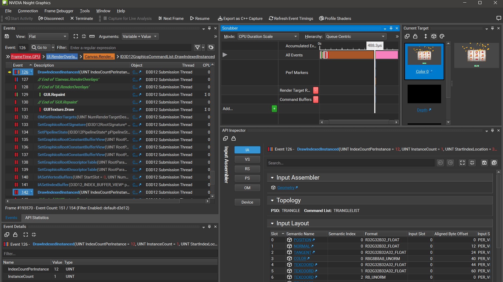
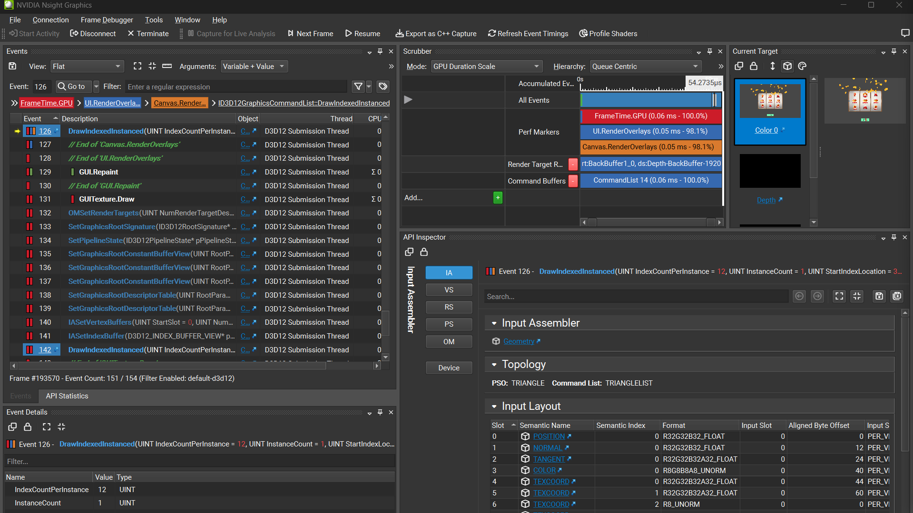
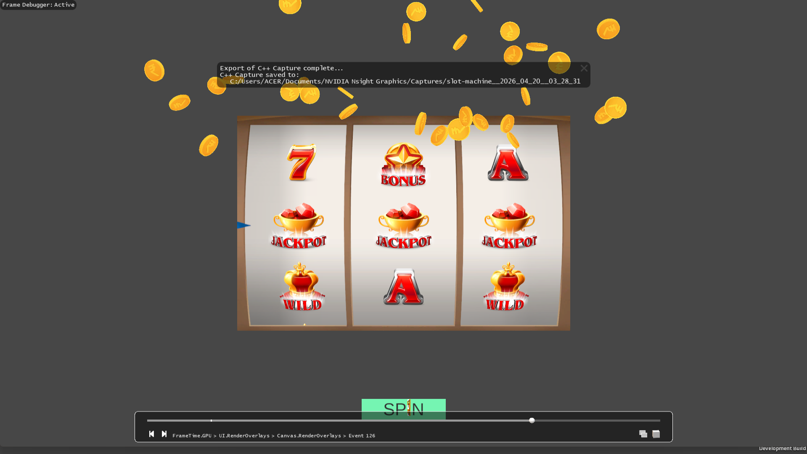

### World Space Build — SRP Batcher OFF

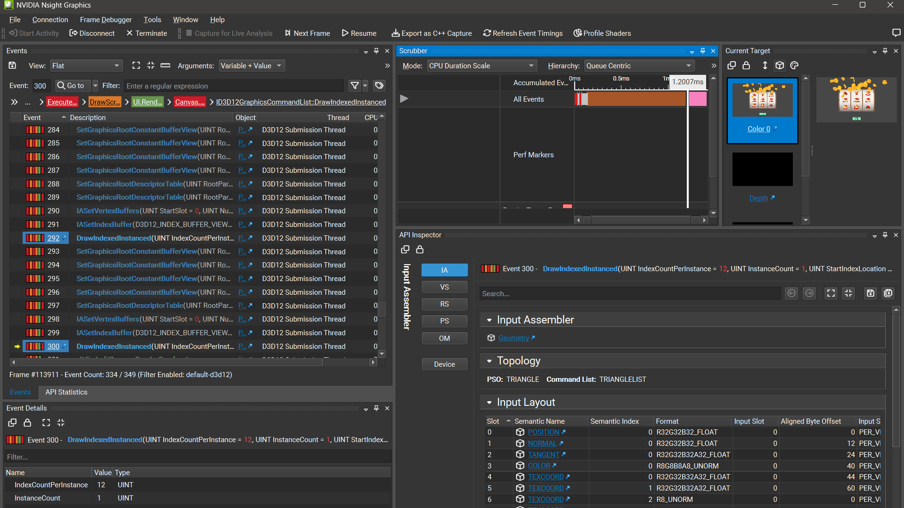
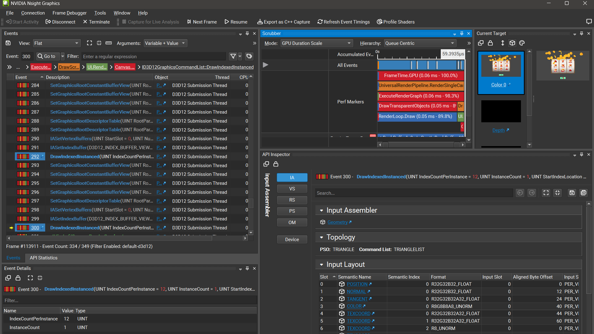
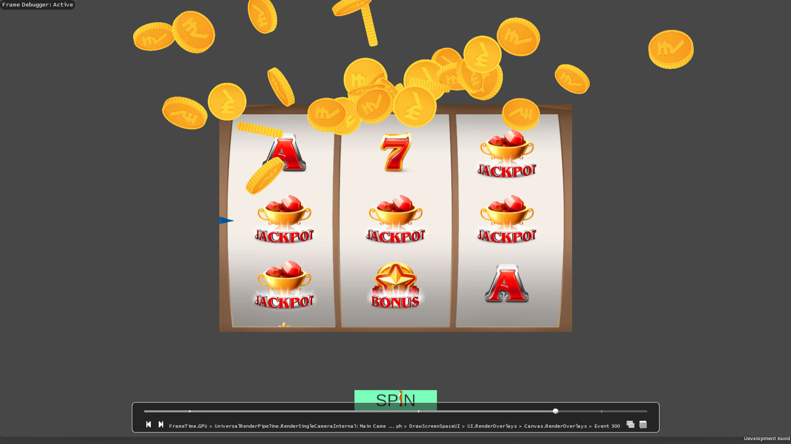

### World Space Build — SRP Batcher ON

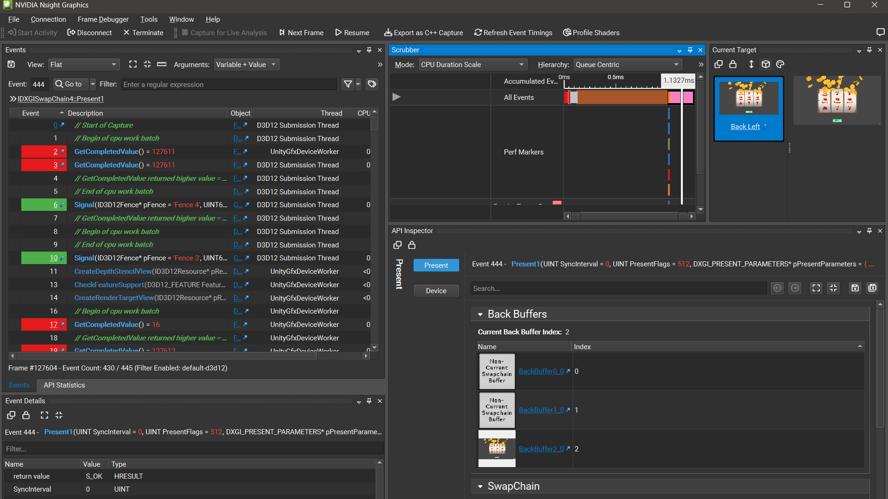
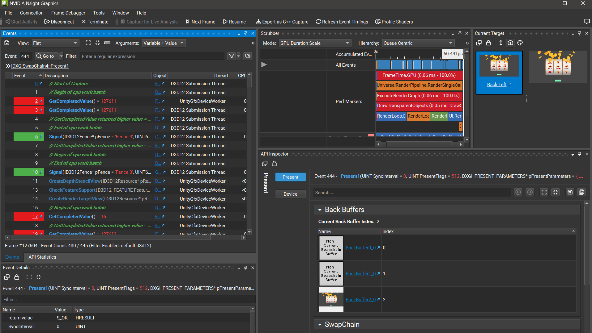
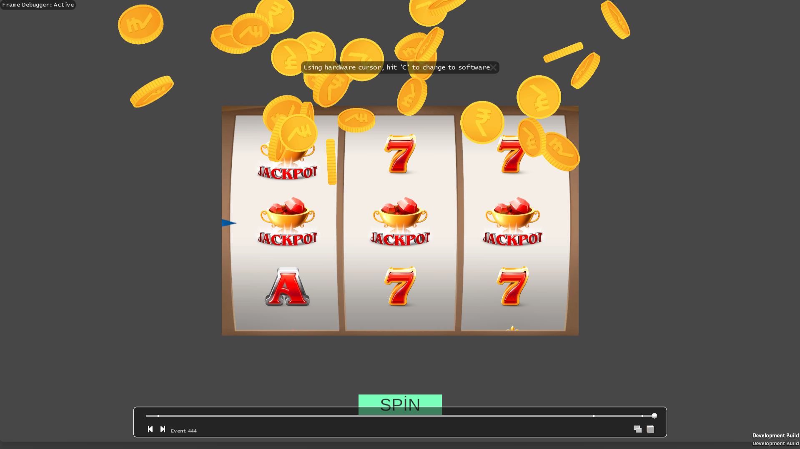

### Ölçüm Özeti

- GPU time üç build'de ~54-60 µs aralığında
- CPU time: UI Canvas 488 µs, World Space (SRP OFF) 1.20 ms, World Space (SRP ON) 1.13 ms
- SRP Batcher açık → kapalı geçişinde CPU time farkı 1.20 ms ↔ 1.13 ms
- FPS: UI Canvas 2200-2500, World Space (SRP OFF) 1200-1600, World Space (SRP ON) 1400-1700

## Editor Frame Debugger Ölçümleri

Editor Play Mode'da alınan pipeline yapısı ve batch dağılımı.

### Stats Paneli

Aşağıdaki ölçüm editor Play Mode'da spin sırasında, coin burst aktifken alındı.

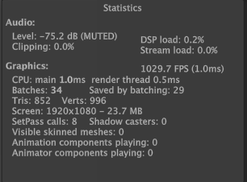

| Metrik          | Değer    |
|-----------------|----------|
| Batches         | 34       |
| Saved by batching | 29     |
| SetPass calls   | 8        |
| Triangles       | 852      |
| Vertices        | 996      |
| FPS             | 1029.7   |
| CPU main thread | 1.0 ms   |
| Render thread   | 0.5 ms   |

### Frame Debugger — SRP Batcher AÇIK

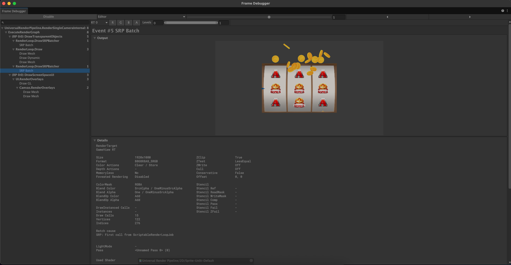

Pipeline pass'leri:

```
DrawTransparentObjects (5 event)
├── DrawSRPBatcher → SRP Batch
├── RenderLoop.Draw (Draw Mesh + Draw Dynamic + Draw Mesh)
└── DrawSRPBatcher → SRP Batch
DrawScreenSpaceUI (3 event)
├── Draw GL
└── Canvas.RenderOverlays (Draw Mesh × 2)
```

Seçili `SRP Batch` event'inin detayında:
- Draw Calls: 15
- Vertices: 122, Indices: 276
- Shader: `Universal Render Pipeline/2D/Sprite-Unlit-Default`
- Batch cause: *SRP: First call from ScriptableRenderLoopJob*

Bu 15 draw call yalnızca reel sembollerinden değil; reel sembolleri + arka plan / çerçeve parçaları + ekran görüntüsünde aktif olan coin'ler tek SRP batch içinde toplanıyor (hepsi `SA_Main` atlas'ını paylaşıyor). Coin pool'u 30'a kadar büyüyebilir; aktif coin sayısı arttıkça aynı SRP batch'in draw call sayısı da büyür, ek bir batch break yaratmaz.

### Frame Debugger — SRP Batcher KAPALI (Karşılaştırma)

Aynı sahnede SRP Batcher devre dışı bırakıldığında pipeline klasik dynamic batching'e düşüyor.

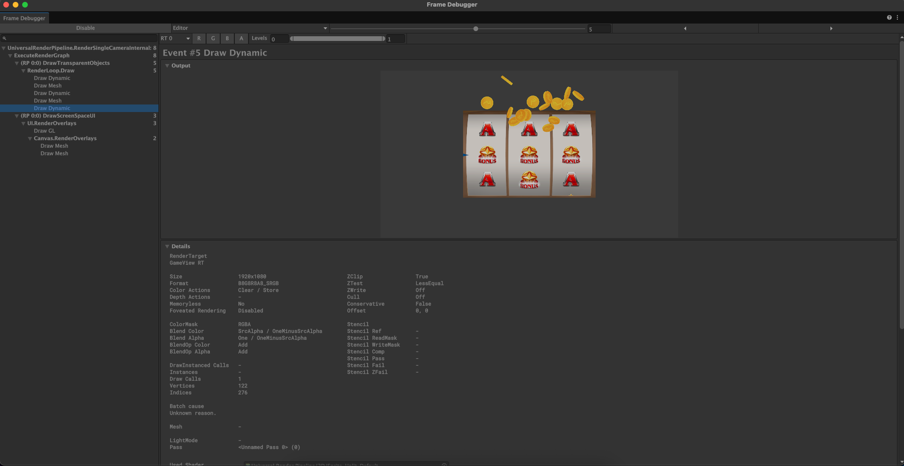

```
DrawTransparentObjects (5 event)
└── RenderLoop.Draw
    ├── Draw Dynamic
    ├── Draw Mesh
    ├── Draw Dynamic
    ├── Draw Mesh
    └── Draw Dynamic
DrawScreenSpaceUI (3 event)
└── ...
```

İki yapılandırmanın özeti:

| Metrik | SRP Batcher AÇIK | SRP Batcher KAPALI |
|--------|:-:|:-:|
| Frame Debugger event | 8 | 8 |
| `DrawTransparentObjects` event | 5 | 5 |
| Transparent pass GPU draw call | ~17 | ~5 |

Projede **SRP Batcher açık** bırakıldı (URP varsayılanı).

## Pipeline Pass'leri

Önceki temizlik adımlarından sonra (bkz. `draw-call-analysis.md` Optimizasyon #4) pipeline minimum durumda:

- ✗ SSAO
- ✗ Skybox
- ✗ CopyDepth
- ✗ CopyColor
- ✗ BlitFinalToBackBuffer
- ✓ DrawTransparentObjects
- ✓ DrawScreenSpaceUI

## Notlar

- **Tüm gameplay sprite'ları aynı SRP batch'de.** Reel sembolleri, arka plan, çerçeve ve coin'ler `SA_Main` atlas'ını paylaştığı için tek bir SRP batch içinde toplanıyor. Coin sayısı arttıkça aynı batch'in draw call sayısı büyür, ek batch break üretmez.
- **TMP "SPIN" yazısı** ayrı font atlası kullandığı için Canvas tarafında ayrı bir batch oluşturuyor; lokalizasyon ve dinamik metin desteği için bilinçli olarak ayrı bırakıldı (bkz. `draw-call-analysis.md` Optimizasyon #3).

## UI Canvas vs World Space — Özet Karşılaştırma

Nsight'tan alınan Windows standalone ölçümleri:

| Metrik | UI Canvas | World Space (SRP ON) |
|--------|:-:|:-:|
| CPU Time | 488.3 µs | 1.13 ms |
| GPU Time | 54.27 µs | 60.44 µs |
| FPS aralığı | 2200 – 2500 | 1400 – 1700 |
